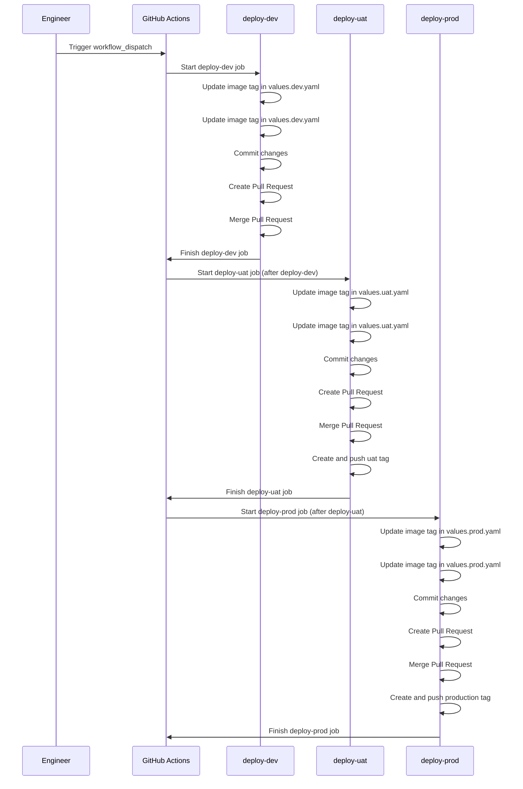

# Demo Deployment
Repository contains deployment resources for the `demo` application

# Kubernetes and Helm chart
- **Kubernetes** is the backbone of our deployment infrastructure. It handles the orchestration, scaling, and management of our containerized applications.
- **Helm** is a package manager for Kubernetes that simplifies the deployment and management of applications. 

In this repository, we use Helm charts to package our Kubernetes manifests. We have separate Values files for different environments:
- **Development**: Uses `values.dev.yaml`
- **UAT**: Uses `values.uat.yaml`
- **Production**: Uses `values.prod.yaml`

You can install the Helm chart to your Kubenetes cluster locally using:
```sh
### Install the Helm chart using the values.dev.yaml file
helm install demo ./helm/demo -f values.dev.yaml
```

# ArgoCD

ArgoCD is our GitOps continuous delivery tool. It ensures that the state of our Kubernetes cluster matches the desired state defined in our Git repository. We have separate ArgoCD application manifests for different environments:

- **Development**: Uses `application.dev.yaml` to deploy the latest code from the `main` branch with `values.dev.yaml`.
- **UAT**: Uses `application.uat.yaml` to deploy the code tagged as `uat` with `values.uat.yaml`.
- **Production**: Uses `application.prod.yaml` to deploy the latest tagged version with `values.prod.yaml`.

To deploy the application using ArgoCD, follow these steps:

1. Install ArgoCD and running in your Kubernetes cluster.
2. Register the application with ArgoCD using the appropriate Application Manifest:
    ```sh
    kubectl apply -n argocd -f application.dev.yaml
    kubectl apply -n argocd -f application.uat.yaml
    kubectl apply -n argocd -f application.prod.yaml
    ```

# CI/CD pipeline
## Separate of Application source code and Kubernetes manifests
The application source code and application deployment resources (.i.e K8s manifest files) are separated because of the following reasons:

- **Separation of Concerns**: This approach allows us to modify configuration files without triggering a full CI build, providing a clear distinction between application code and configuration.
- **Cleaner Audit Logs**: By isolating configuration changes, we maintain a cleaner Git history focused solely on configuration updates, free from the noise of regular development activity.
- **Support for Multi-Repo Applications**: Our application consists of services from multiple Git repositories, each with its own versioning scheme and release cycle. Storing manifests separately ensures a cohesive deployment process.
- **Access Control**: Different access permissions can be set for developers and production deployment, preventing unauthorized changes to production environments.
- **Avoiding CI Loops**: This separation prevents infinite loops of build jobs and Git commit triggers, ensuring a more stable and efficient CI pipeline.

## Trunk-Based Development
The CI/CD pipeline is designed for Trunk-Based Development flow. In trunk-based development:
- **Single Branch**: All developers work on a single branch (usually main or master), the single branch is expected to be deployable at all times.
- **Short-Lived Feature Branches**: Feature branches are short-lived and merged back into the main branch quickly to reduce merge conflicts.

## GitHub Workflows
The CI/CD pipeline is implemented using GitHub Workflows:
1. The deployment workflow is triggered from the source repository or manually using the `workflow_dispatch` event.
2. The workflow updates the Docker image tag in environment-specific values files (values.dev.yaml, values.uat.yaml, values.prod.yaml).
3. The `deploy-uat` job always create the `uat` tag, if the there's an `uat` tag exists, the tag will be pinned to the latest commit.
4. The `deploy-prod` job creates a production tag based on the Helm version specified in the Chart.yaml file.
5. The `deploy-prod` job uses PRODUCTION environment that must be approved by the GitHub App. Hence, the `deploy-prod` job must be manually approved before it can be executed.

### Trigger Deployment
